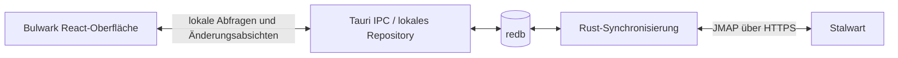

# Architektur: lokale Replik als Arbeitsgrundlage

Stand: 14. November 2026. Die folgenden Abschnitte beschreiben den aktuellen
Implementierungsstand. Frühere Ausbaustufen stehen am Ende als Entwicklungshistorie.

## Aktueller Überblick

- Die originale Bulwark-Oberfläche bleibt im unveränderten, fixierten Submodul.
  Desktopadapter und geprüfte Build-Transforms liegen außerhalb davon.
- UI-Lesezugriffe laufen über native IPC und redb. Zugangsdaten bleiben in Rust
  und im Systemschlüsselbund; nur die native Synchronisierung spricht mit Stalwart.
- Mail unterstützt lokale Lesezugriffe, Gelesen-/Sternänderungen, Verschieben,
  Papierkorb und lokale Entwürfe. Schreibabsichten werden dauerhaft gespeichert.
- Strukturierter Versand wird vor dem Netzwerkaufruf in redb journalisiert.
  Online kann der native Versandpfad unmittelbar die echte Serverantwort liefern;
  offline oder zur Prüfung gehaltene Aufträge liefern ein ausdrückliches
  queued-Ergebnis und warten auf Freigabe. Unklare Sendungen werden nicht
  automatisch wiederholt. Entwürfe werden noch nicht mit dem Server synchronisiert.
- Kalenderereignisse und Dateimetadaten nutzen lokale Überlagerungen und das
  Schreibjournal. Neue Datei-Uploads und Composer-Anhänge werden ebenfalls
  lokal gehalten und als Abhängigkeiten freigegebener Aufträge hochgeladen.
  Datei-Inhaltsersetzungen, Kontakte und Kalenderverwaltung fehlen noch.
- Blob-Downloads werden kontogetrennt in redb gespeichert und funktionieren danach
  offline. Automatische Cachebereinigung fehlt.
- Offline-Aufträge benötigen beim Wiederverbinden eine Auswahl zur Übertragung.
  Reine Entwürfe zählen nicht als ausstehende Aktionen. Blockierte und unklare
  Aufträge werden durch eine pauschale Freigabe nicht erneut versendet.
- JMAP_READ_ONLY ist standardmäßig aktiv. Die bestehende Live-Schreibfreigabe gilt
  für Gelesen-/Sternänderungen, den reversiblen Flag-Test und den separat
  begrenzten Upload fester 1-KiB-Testdaten. Versand-, Kalender-, FileNode- und
  Verschiebetests benötigen eine eigene Freigabe
  für echte Serveränderungen.

## Aktuelle Verifikation

Am 14. November 2026 am aktuellen Arbeitsstand ausgeführt:

- `npm run build`: erfolgreich, einschließlich TypeScript-Prüfung; Vite meldet
  große Bundles und teilweise zugleich statische und dynamische Imports.
- `npm run check:native`: erfolgreich.
- `npm run test:native`: 64 bestanden, sieben Live-Tests regulär ignoriert.
  Der separat gegatete 1-KiB-Upload-Live-Test wurde zusätzlich erfolgreich ausgeführt.
- `cargo fmt --manifest-path src-tauri/Cargo.toml -- --check`: erfolgreich.
- `npm exec playwright -- test` gegen Vite-Preview auf Port 1430:
  fünf Tests bestanden, mit synthetischen Daten und nachgebildeter IPC-Grenze.

Diese Prüfung hat keine echten Mails versendet oder Serverdaten verändert.
Sie ersetzt keine native Funktionsprüfung auf Linux/macOS und keinen
Live-Nachweis für Versand, Kalender- oder Dateiänderungen. Das Upstream-Submodul
steht unverändert auf `03e7cd86f102bc66a589b7b02d49523b00ae633a`.

## Nächste Arbeit

1. Versand mit Anhängen und FileNode-Erstellung separat freigeben und live prüfen;
   Datei-Inhaltsersetzungen und Verwaltung verwaister Uploads ergänzen.
2. Den Konfliktvergleich um freie Bearbeitung einzelner Felder und eine
   durchsuchbare Übersicht abgeschlossener Aufträge erweitern.
3. Kontakte und noch fehlende lokale JMAP-Methoden portieren.
4. Große Postfächer mit paginierter Staging-Ablage und lokalen Seitenabfragen
   unterstützen; Cachebereinigung und Speicherverwaltung ergänzen.
5. Lokale Daten verschlüsseln, Linux/macOS vollständig prüfen und
   Installationspakete, Signierung sowie Updates einrichten.

## Entwicklungshistorie

Die nachfolgenden Ausbaustufen dokumentieren die Entwicklung in zeitlicher
Reihenfolge. Aussagen wie „fehlt noch“, alte Testzahlen und frühere
Transportgrenzen beziehen sich auf die jeweilige Stufe. Für den heutigen
Funktionsumfang gelten der aktuelle Überblick und die neuesten Abschnitte zu
Schreibjournal, Uploads und lokaler Konfliktauflösung.

Herakles Mail passt die Oberfläche und das Add-on-Modell von [Bulwark Webmail](https://github.com/bulwarkmail/webmail) für einen Offline-Desktopclient an. [Stalwart](https://www.stalwart.email/) ist das primäre JMAP-Serverziel und läuft unabhängig vom Client. Projektdanksagungen und Lizenzhinweise stehen im [README](../README.md#acknowledgements) und in der [NOTICE](../NOTICE).

## Verbindlicher Datenfluss

```mermaid

flowchart LR

    UI[Bulwark React-Oberfläche] <-->|lokale Abfragen und Änderungsabsichten| IPC[Tauri IPC / lokales Repository]

    IPC <--> DB[(redb)]

    DB <--> SYNC[Rust-Synchronisierung]

    SYNC <-->|JMAP über HTTPS| SERVER[Stalwart]

```

Die Oberfläche arbeitet immer mit redb, auch bei bestehender Internetverbindung.

Änderungen werden zuerst dauerhaft lokal gespeichert. Nur die Rust-Synchronisierung

kommuniziert mit Stalwart. Netzwerkfehler dürfen weder lokale Lesezugriffe verhindern

noch ausstehende Änderungen löschen. redb stellt Persistenz bereit; die

Synchronisierung ist eigener Anwendungscode.

## Upstream und Integrationsgrenze

Bulwark 1.20.0 liegt als unverändertes Git-Submodul unter `upstream/bulwark`, fixiert

auf `03e7cd86f102bc66a589b7b02d49523b00ae633a`. Quelle und Lizenz stehen zusätzlich

in `upstream/bulwark.lock.json`. LICENSE und NOTICE bleiben im Submodul erhalten.

Nach einem frischen Checkout: `git submodule update --init`.

Bulwarks bestehender Client (`lib/jmap/client.ts`) verwendet direkte Serverzugriffe

und registrierbare Hooks aus `lib/jmap/offline-hooks.ts`. Der Browser-Offline-Modus

in `lib/offline/` nutzt IndexedDB und ist ein Fallback. Das entspricht noch nicht

dem verbindlichen Desktop-Datenfluss.

Für die Übernahme werden ein lokaler JMAP-kompatibler Adapter und der gespeicherte

Sitzungszustand benötigt. `JMAPClient.fromOfflineSession` ist ein vorhandener

Einstiegspunkt für einen Client ohne Netzwerkzugriff. Der Desktop-Adapter muss

lokale Reads und Writes beantworten, Änderungen an die Stores melden und weitere

Netzwerkpfade (Sitzung, Blob-Download, Upload, Events) ebenfalls auf Rust umstellen.

Ein bloßer Austausch von IndexedDB durch redb reicht nicht. Die bestehende

IndexedDB-Synchronisierung darf nicht parallel mit dem Rust-Worker schreiben.

Die ursprünglichen Bulwark-Oberflächen werden jetzt über src/desktop/BulwarkApp.tsx eingebunden. Routing, Plugin-Binärspeicher und Offline-Hooks sind durch Desktop-Adapter ersetzt. Der lokale JMAP-Responder implementiert Mailbox/query/get, Email/query/get und Thread/get einschließlich Ergebnisreferenzen; andere Methoden bleiben unvollständig oder werden abgelehnt.

## Implementierter erster Datenpfad

- `src/mail-repository.ts`: lokale IPC-Abfragen, persistente Flag-Änderungen und separater Synchronisierungsaufruf.

- `src/desktop/`: originale Bulwark-Komponenten und Hostadapter. Lokale Sitzung zuerst laden, dann Hintergrundabgleich. Die ältere LocalMailbox-Entwicklungsansicht ist kein Anwendungseinstieg mehr.

- `src-tauri/src/replica.rs`: kontogetrennte Objekte, Serverzustände und geordnete Änderungswarteschlange in redb.

- `src-tauri/src/sync.rs`: HTTPS-Sitzungsermittlung, Mailbox-Vollabgleich, Email-Erstabgleich und paginierte `Email/changes`-Abgleiche.

Objekte und ihr Serverzustand werden transaktional geschrieben. Ein abgebrochener

Abgleich veröffentlicht keinen unvollständigen Checkpoint. `cannotCalculateChanges`

löst einen neuen Vollabgleich aus. Beim Erstabgleich wird geprüft, dass sich der

Email-Zustand während der Abfrage nicht geändert hat; sonst wird ohne Veröffentlichung

abgebrochen und beim nächsten Durchlauf erneut versucht.

Lokale Änderungen liegen als separate Absichten über dem Serverdatenbestand.

Dadurch überschreibt ein Download sie nicht. Die Warteschlange überlebt Neustarts

und Vollabgleiche. Erfolgreiche Änderungen werden einzeln bestätigt; später erzeugte

Änderungen bleiben erhalten. `ifInState` schützt Serverupdates; ein `stateMismatch`

bleibt für den nächsten Abgleich vorgemerkt. Für unterstützte Flags gilt: Die jüngste

lokale Absicht wird nach Aktualisierung der Serverbasis erneut versucht.

Permanente Fehler wie fehlende Nachrichten oder Schreibrechte bleiben sichtbar als

blockierte Einträge gespeichert und verhindern nicht den Abgleich anderer Änderungen.

Eine Oberfläche zum Verwerfen oder erneuten Freigeben dieser Einträge fehlt noch.

Nur idempotente Gelesen-/Markiert-Updates werden automatisch wiederholt; Versand

braucht eine separate Strategie gegen doppelte Zustellung.

## Noch offene Arbeit

- Die eingebundene Bulwark-Oberfläche funktional vervollständigen; alle JMAP-Lese-/Schreibmethoden, Ereignisse und Nebenpfade abdecken.

- Verschieben, Löschen, Entwürfe, Versand, Suchindex und weitere Mailfunktionen.

- Vollständige HTML-Textteile und Anhänge offline; aktuell Text-/HTML-Teile mit maximal 256 KiB pro Teil, keine Blob-Synchronisierung.

- Kalender, Kontakte, Dateien und die Funktionen der vollständigen Bulwark-Edition einschließlich OAuth, 2FA, Admin, Plugins und Einstellungssynchronisierung.

- Erstabgleich mit paginierter Staging-Ablage statt derzeitigem Aufbau im Arbeitsspeicher; lokale Seitenabfragen statt vollständiger Nachrichtenlisten.

- Der erste Zugang wird vor dem Speichern per JMAP-Sitzung geprüft und im nativen Systemschlüsselbund gesichert. Eine vorhandene `.env.local`/`.env.local.old` dient nur zur einmaligen Debug-Migration. Die Profilregistrierung liegt in redb; jedes Profil enthält mehrere Konten, deren Zugangsdaten getrennt im Systemschlüsselbund liegen. Profil- und Kontowechsel laden den ausgewählten JMAP-Zugang neu und trennen Profilcaches.

- Verschlüsselung lokaler Kontodaten, Speicherlimits und Cache-Verwaltung.

- Native Linux-/macOS-Validierung, Installationspakete, Signierung und Updates.

## Verifikation

24 Rust-Tests prüfen Persistenz nach Neustart, Kontotrennung, atomare Checkpoints,

Vollabgleich-Rennen, paginierte Deltas, Netzwerkabbrüche, abgelaufene Zustände,

Bestätigungen, lokale Folgeänderungen und permanente Ablehnungen. Der Frontend-Build

mit TypeScript 7.0.2 und der Windows-Tauri-Debug-Build sind erfolgreich. Linux und

macOS und ein vollständiger Live-Erstabgleich sind noch nicht getestet. Ein separat ausgeführter Nur-Lese-Live-Test hat Sitzung, Mailboxen, bis zu zehn Nachrichten und das erneute Lesen aus redb erfolgreich geprüft. Die automatisierten

Sync-Tests verwenden einen skriptgesteuerten Transport statt eines echten Servers.

## Nur-Lese-Betrieb

JMAP_READ_ONLY ist standardmäßig true. Die native IPC-Schicht sperrt neue Änderungen, der Synchronisierer überspringt die Warteschlange und der HTTP-Transport erlaubt nur Mailbox/get, Email/get, Email/query und Email/changes. Unbekannte Methoden sind gesperrt. Der Live-Test erzwingt diesen Modus unabhängig von der Konfiguration und verwendet eine temporäre Datenbank. Sitzungsumleitungen sind nur innerhalb derselben HTTPS-Herkunft erlaubt.

## Originale Oberfläche und Add-ons

Der Einstieg nutzt Bulwarks originale Mailansicht sowie Einstellungen, Kalender-, Kontakt- und Datei-Komponenten. Mail und Kalender sind lesend an die lokale Replik angebunden; Kontakte und Dateien sind noch offen. Plugin-Installation und Sandbox-Ausführung nutzen das originale Paketformat und die originalen Host-APIs. Pakete und UI-/Plugin-Daten liegen in redb. Details und ausdrücklich noch nicht unterstützte APIs: docs/addons.md.

Der Browser-Integrationstest prüft mit synthetischen Daten Mailanzeige, ZIP-Installation, Aktivierung, einen Plugin-Speicherzugriff und Wiederladen nach Neustart. Die native Testsuite enthält zusätzlich Tests für lokale Abfragen und JMAP-Ergebnisreferenzen. Keine vollständige Funktionsgleichheit oder plattformübergreifende Plugin-Kompatibilität ist damit nachgewiesen.

## Kalender-Replik

Der Desktop-Bootstrap initialisiert Bulwarks Kalenderfähigkeit ausdrücklich; dies fehlte bisher und versteckte den Navigationseintrag. src-tauri/src/calendar.rs speichert kontogetrennte Kalender-Snapshots inklusive Teilnehmeridentitäten, Terminen, Wiederholungsregeln und Overrides. Vollabgleich und CalendarEvent/changes veröffentlichen einen neuen Snapshot erst nach erfolgreichem Abschluss. Ein Abbruch erhält den alten Snapshot. Stalwarts getrennte Abrufe von utcStart/utcEnd und recurrenceOverrides werden berücksichtigt.

src/desktop/calendar.ts beantwortet lokale Kalender-JMAP-Aufrufe. Kalenderrechte werden im Nur-Lese-Modus eingeschränkt; Schreibmethoden werden abgelehnt. Datumsbereiche und Wiederholungen verwenden Bulwarks vorhandene Zeit- und Wiederholungshelfer. Die Kalenderansicht wird nach erfolgreichem Hintergrundabgleich aktualisiert. Gemeinsame Konten und alle Suchfilter sind noch nicht vollständig abgedeckt.

Der Live-Nur-Lese-Test hat einen Kalender und zwei Termine inklusive Folgeabgleich und erneutem redb-Öffnen geprüft. Der synthetische UI-Test prüft die Kalendernavigation, Terminanzeige und erneute Anzeige bei nicht erreichbarem Server. Der Schließpfad wird zusätzlich durch zwei Tests und einen echten Windows-Prozess-Schließtest geprüft.

## Freigaben und Sitzungsaktualisierung

`refresh_desktop_session` aktualisiert den lokal gespeicherten JMAP-Kontobestand.

Die App startet weiterhin sofort aus der gespeicherten Sitzung. Im Hintergrund

werden Änderungen an Session-State, Accounts und Fähigkeiten erkannt und der

ursprüngliche Bulwark-Client mit der neuen lokalen Sitzung ersetzt. Ohne Netzwerk

bleibt die zuletzt bekannte Sitzung verfügbar.

`src/desktop/accounts.ts` wählt alle persönlichen und freigegebenen Konten pro

Fähigkeit aus. Wie im Upstream gilt der serverweite Capability-Fallback nur für

explizit freigegebene Accounts mit leerer Capability-Liste, niemals gegen eine

explizite Einschränkung. Rust prüft dieselbe Regel beim Verbindungsaufbau.

`local_jmap` beantwortet auch gemischte Batches mit verschiedenen accountIds aus

separaten lokalen Repliken. Ergebnisreferenzen bleiben an ihre benannten früheren

Antworten gebunden. Vor dem Lesen werden aktuelle Sitzungszugehörigkeit und

Capability geprüft. Entfernte Konten werden nach erfolgreicher Sitzungsaktualisierung

nicht mehr über den nativen Adapter ausgeliefert. Offline kann eine noch unbekannte

serverseitige Rechteänderung naturgemäß erst beim nächsten erfolgreichen Kontakt

berücksichtigt werden. Alte Cache-Dateien werden nicht automatisch gelöscht.

Jeder Abgleich lädt zunächst alle erlaubten Mailbox-Bäume. Danach werden Kalender

und Nachrichten getrennt je Account synchronisiert. Ein Fehler in einer Freigabe

verhindert nicht den Versuch für andere Konten. Abgelehnte Kalender-Probes für reine

Mailfreigaben werden lokal markiert und an Bulwark als accountNotSupportedByMethod

beantwortet. Dadurch verschwinden berechtigte persönliche Kalender nicht wegen

einer Mailfreigabe ohne Kalenderrecht.

Verifikation: 24 native Tests und vier Browser-Tests; darunter Account-Isolation bei

gleichen Objekt-IDs, gemischte JMAP-Batches, entfernte Freigaben, Capability-Fallbacks,

freigegebene Ordner/Nachrichten und Kalender nach Offline-Neustart. Der Live-Test hat

sieben freigegebene Mailkonten mit Mailbox/get und einer begrenzten Email/query sowie Email/get für höchstens eine Nachricht je nicht leerem Konto geprüft.

Für diese sieben Freigaben meldet Stalwart keine Kalenderunterstützung. Der Test

hat keine Serverdaten verändert und eine temporäre Datenbank verwendet.

## Erster Schreibumfang

Der Benutzer hat den Schreibtest ausdrücklich freigegeben. Die native lokale

JMAP-Schicht akzeptiert Email/set ausschließlich für Änderungen an $seen/$flagged.

Jede Änderung an einer Nachricht wird atomar mit ihren Warteschlangeneinträgen in

redb gespeichert. Ein ungültiger gemischter Patch erzeugt keine halbe Änderung.

Nachfolgende Reads im selben JMAP-Batch sehen den lokal vorgemerkten Zustand.

Serverseitig schreibgeschützte Accounts und der konfigurierbare Nur-Lese-Modus

werden weiterhin geprüft. Ungelesen-/Thread-Zähler werden aus der lokalen Replik

berechnet, damit sie auch vor dem Serverabgleich stimmen.

Der native Synchronisierer verwendet idempotente Keyword-Patches mit ifInState,

bestätigt einzelne Queue-Einträge und liest danach den Serverzustand nach.

Schreibereignisse und Reconnects starten einen Abgleich. Ereignisse während eines

laufenden Abgleichs fordern einen weiteren Durchlauf an; es laufen keine zwei

Worker parallel. Die Statusleiste zeigt die Zahl ausstehender und blockierter

Änderungen. Andere Schreibmethoden bleiben auf der lokalen bzw. Transportgrenze

gesperrt, insbesondere Kalenderänderungen und Versand.

Der explizit gegatete Live-Test hat eine Stern-Markierung über dieselbe persistente

Warteschlange geändert, serverseitig gelesen und mit einem frischen Serverzustand

zurückgesetzt. Er verwendet eine temporäre Datenbank und schreibt vor der Mutation

einen lokalen Recovery-Datensatz ohne Zugangsdaten. Auch nach einem Timeout wird

die Wiederherstellung versucht. Der UI-Test prüft Stern-Änderung bei simuliertem

Serverausfall, den sichtbaren Pending-Status und die spätere Synchronisierung bei

Reconnect. Dies belegt keine Funktionsgleichheit für weitere Schreiboperationen.

## Upstream-Aktualisierungen

`upstream/bulwark` bleibt ein unverändertes Git-Submodul. Desktop-Anpassungen liegen in `src/desktop/`, `src-tauri/` und den kontrollierten Build-Transforms in `vite.config.ts`; dadurch gibt es keine zu pflegenden Upstream-Patches. Für ein Update den gewünschten Bulwark-Commit im Submodul auschecken, danach `upstream/bulwark.lock.json` mit Commit, Version und Lizenz aktualisieren und `npm run build`, `cargo check --manifest-path src-tauri/Cargo.toml` sowie die Browser-Integrationstests ausführen. Anschließend insbesondere Mail-Lesen, Composer, Plugins und geteilte Konten prüfen. Änderungen an Upstream-Dateien gehören nur dann ins Submodul, wenn sie zuerst upstream übernommen wurden.

## Composer-Transport (erster Schritt)

Der originale Composer bleibt unverändert. `src/desktop/bootstrap.ts` leitet Identitätsabfragen und den expliziten Sende-Batch an den Tauri-Befehl `composer_request` weiter. `src-tauri/src/sync.rs` beschränkt ihn auf diese Methoden, prüft Schreibrechte und Capability, nutzt HTTPS und führt keine automatische Wiederholung aus. Zugangsdaten bleiben in Rust. Der Versand ist online-only; eine unklare Transportantwort wird als Fehler angezeigt, damit Nutzer die Zustellung prüfen können, bevor sie erneut senden. Der Sendevorgang ist noch nicht redb-first und umfasst keine Uploads/Anhänge. Entwürfe werden als lokale Email-Objekte in redb gespeichert und nach Neustart angezeigt, aber noch nicht mit Stalwart synchronisiert. Dies ist keine vollständige Mail-Parität.

## Produktname und lokale Daten

Die sichtbare Produktkennung lautet Herakles Mail. Die bestehende Tauri-Anwendungskennung `org.jmapdesktop.client` bleibt vorerst stabil, weil Tauri sie für das App-Datenverzeichnis mit der redb-Mailreplik verwendet. Ein Wechsel benötigt einen getesteten Datenbank-Migrationspfad; ohne ihn würde die bisherige lokale Mailkopie scheinbar verschwinden.

## Diagnose-Protokoll

Native Ereignisse werden als eine JSON-Zeile pro Event in `logs/herakles.jsonl` im Tauri-App-Datenordner geschrieben; bei 2 MiB wird rotiert, drei ältere Dateien bleiben erhalten. Auf Windows liegt der Ordner unter `%APPDATA%\\org.jmapdesktop.client\\logs`. Rust protokolliert Sync-, Composer-, Entwurfs- und Speichervorgänge. Felder enthalten Eventname und Fehlerklasse, keine JMAP-Rohantworten, Zugangsdaten, Adressen oder Nachrichteninhalte. Die Statuszeile zeigt zusätzlich ausstehende und blockierte Entwurfslöschungen; genaue Syncfehler erscheinen dort.

## Push und Online-Modus

Der native Client hält Stalwarts JMAP-EventSource-Verbindung (SSE) offen. `StateChange`-Ereignisse lösen einen normalen Delta-Abgleich nach redb aus; bei Verbindungsabbruch verbindet Rust erneut. Bei aktiver SSE-Verbindung gibt es keinen periodischen Abgleich. Ein Abgleich erfolgt beim Start, nach lokalen Schreibabsichten, beim Wechsel von Offline auf Online und nach Push-Reconnect. StateChange-Meldungen werden fuer 750 ms gebuendelt. Nur solange Push getrennt ist, erfolgt ein Sicherheitsabgleich nach 60 Sekunden. Die SSE-Verbindung wird nach 90 Sekunden ohne Daten als unterbrochen behandelt (angeforderter Ping: 30 Sekunden). Der Schalter unten rechts setzt einen gespeicherten Offline-Modus, der Sync, Push und Versand pausiert; im Automatikmodus folgt die App dem System-Netzwerkstatus. „Online“ zeigt einen erfolgreichen Serverabgleich an, nicht nur eine aktive WLAN-Verbindung. Auf Android funktioniert die SSE-Verbindung im Vordergrund; Benachrichtigungen bei pausierter oder geschlossener App benötigen später eine Android-Push-Subscription.

## Mail: Verschieben und Papierkorb

Der lokale Email/set-Adapter akzeptiert zus�tzlich mailboxIds-Ersetzungen und

JSON-Pointer-Patches. Er pr�ft vorhandene Zielordner, mayAddItems/mayRemoveItems

und mindestens eine verbleibende Ordnerzuordnung. Gemischte ung�ltige Patches

werden vor dem Speichern verworfen. Bulwarks originale Verschiebe- und

Papierkorbaktionen bleiben unver�ndert.

Die vollst�ndige gew�nschte Ordnerzuordnung wird als dauerhafte Absicht in der

bestehenden redb-Warteschlange gespeichert. Der Worker sendet eine idempotente

mailboxIds-Ersetzung mit ifInState; bei Konflikten bleibt die Absicht f�r den

n�chsten Abgleich erhalten. Wie bei Flags gewinnt die sp�teste lokale Absicht

nach Aktualisierung der Serverbasis. Permanente Ablehnungen bleiben sichtbar

blockiert. Endg�ltiges L�schen normaler Nachrichten bleibt gesperrt.

Synthetische Tests pr�fen Ordnerrechte, Pointer-Escapes, ung�ltige Mischpatches,

Neustart, Kontotrennung, Vollabgleich und Best�tigung vor einer neueren �nderung.

Ein Live-Verschiebetest und die Pr�fung der nativen Oberfl�che auf Linux stehen

noch aus. Laut Benutzer startet und l�uft der Client inzwischen auch auf Linux;

eine vollst�ndige Linux-Funktionspr�fung ist damit noch nicht dokumentiert.

Der Browser-Integrationstest pr�ft zus�tzlich die originale Papierkorbaktion bei

simuliertem Serverausfall, den Pending-Status, erneutes Laden und anschlie�enden

Reconnect. Die native Testsuite umfasst jetzt 38 erfolgreiche synthetische Tests;

f�nf Live-Tests bleiben standardm��ig ignoriert.

## Mail-Anhaenge und Offline-Downloads

`src-tauri/src/blobs.rs` speichert unveraenderliche Blob-Bytes in einer eigenen

redb-Tabelle, getrennt nach Profil/Server/Login/JMAP-Konto. `local_blob` prueft

aktuelle lokale Sitzungsrechte und eine Referenz aus einer lokal vorhandenen

Nachricht. Ein Cacheeintrag allein berechtigt nicht zum Lesen. Nach serverseitiger

Nachrichtenloeschung sind verwaiste Cacheeintraege nicht mehr ueber IPC abrufbar.

Bulwarks originaler Blob-Hook liest zuerst redb. Bei einem Cachemiss fordert er

`sync_blob` an; nur Rust laedt die Datei und speichert sie vor dem erneuten lokalen

Lesen. Parallele Anfragen derselben Datei werden im Desktop-Adapter gebuendelt.

Der Download verwendet JMAPs downloadUrl-Vorlage gemaess RFC 8620 Abschnitt 6.2

(https://www.rfc-editor.org/rfc/rfc8620.html#section-6.2). Platzhalter werden

percent-codiert; ausschliesslich dieselbe HTTPS-Herkunft wie die API ist erlaubt.

HTTP-Umleitungen werden nicht verfolgt. Zugangsdaten und Downloadantworten werden

nicht protokolliert. Antwortgroesse und bekannte Part-Groesse werden geprueft;

unvollstaendige Downloads werden nicht in redb veroeffentlicht.

Beim regulaeren Mailabgleich werden bis zu vier fehlende Teile mit jeweils

hoechstens 1 MiB vorgeladen (maximal 4 MiB und zehn Sekunden pro Durchlauf).

Groessere Teile und Originalnachrichten laden bei Bedarf nach. Das Downloadlimit

liegt bei 25 MiB pro Blob, das Cachelimit bei 256 MiB pro Konto. Ein voller Cache

verhindert weitere Downloads, vorhandene Dateien bleiben lesbar. Automatische

Bereinigung, ein Cachemanager, Uploads und Composer-Anhaenge fehlen noch. Bereits

heruntergeladene Anhaenge funktionieren offline; noch fehlende Dateien brauchen

eine Verbindung. Das betrifft auch noch nicht gespeicherte HTML-Inlinebilder.

Verifikation: Native Tests pruefen Binaerdaten nach Neustart, Kontotrennung,

Referenzpruefung nach Loeschung, Unveraenderlichkeit, Dateigroessenlimit und sichere

Downloadvorlagen. Der Browser-Integrationstest laedt ueber die originale

Anhang-Schaltflaeche eine synthetische Binaerdatei und vergleicht ihre Bytes;

ein zweiter Download bei simuliertem Serverausfall verwendet den lokalen Cache.

`live_blob_read_only` erzwingt read-only, laedt hoechstens einen kleinen Anhang aus

einer auf zehn Nachrichten begrenzten Stichprobe und benutzt eine temporaere

Datenbank. Der erste Live-Versuch am 2026-11-04 scheiterte vor dem Serverkontakt,

weil im Testprozess kein nutzbarer Zugang geladen werden konnte.

Die Verbindungsanzeige unterscheidet Offline, Sync mit aktuellem Arbeitsschritt
(Sitzung, Ordner, Kalender, Nachrichten oder lokale Ansicht) und Online. Ein
Abgleichfehler nach erfolgreichem Serverkontakt erscheint separat. Tests pruefen
Leerlauf ohne Polling bei aktivem Push, gebuendelte Push-Meldungen, Sicherheits-
abgleich bei Push-Ausfall, Reconnect und den manuellen Offline-/Online-Wechsel.

## Composer: Offline-Ablehnung und Submission-Bereinigung

Offline-Sendeversuche werden vor jedem Serverzugriff nativ abgelehnt. Der
Desktopadapter uebersetzt ausschliesslich diese lokale Offline-Ablehnung in
Bulwarks OfflineUnavailableError. Netzwerkfehler nach moeglichem Versand werden
nicht als sicher ungesendet eingestuft und niemals automatisch wiederholt.
Ein Eintrag in Gesendet bzw. eine angenommene EmailSubmission beweist keine
Ablage im Posteingang des Empfaengers.

Angenommene Submission-IDs erhalten einen kontogetrennten Beleg in redb. Der
urspruengliche Bulwark-Aufruf zur anschliessenden Bereinigung darf ausschliesslich
diese Submission-Metadaten entfernen; unbekannte IDs, andere Konten, Update-Patches
und der Nur-Lese-Modus bleiben gesperrt. Nachrichten werden dabei nicht geloescht
oder nochmals versendet. Gemischte Entwurfs-/Submission-Bereinigungsbatches werden
auf den lokalen Entwurfspfad und den begrenzten nativen Submission-Pfad aufgeteilt.
Ein Fehler beim lokalen Speichern des Belegs wird protokolliert, darf aber einen
bereits angenommenen Versand nicht nachtraeglich als gescheitert zurueckgeben.

Die Desktop-Statuszeile reserviert unten 40 Pixel ausserhalb des Bulwark-
Arbeitsbereichs. Verbindungsumschalter, Profile und Abgleichstatus liegen darin;
der Composer und seine Senden-Schaltflaeche enden darueber. Browserpruefungen
kontrollieren die getrennten Bereiche bei 1440 und 640 Pixeln Fensterbreite
sowie mit geoeffnetem Composer im Desktoplayout.

## Desktop-Schreibjournal und Offline-Freigabe (aktueller Stand)

Die Offline-Schreiblogik liegt vollstaendig ausserhalb des unveraenderten
Bulwark-Submoduls: in src/desktop/ und im nativen Rust-Adapter. Die unteren
Status- und Freigabedialoge gehoeren zur Desktophuelle. Gepruefte Build-Transforms
verbinden die originalen Composer- und Kalenderaktionen mit den Desktopadaptern;
es gibt keinen Bulwark-Fork und keine Aenderung am Upstream-Quellbaum.

Eine strukturierte Mail wird vor jedem Versand als fertiger JMAP-Auftrag mit
stabiler Message-ID in redb gespeichert. Bei gehaltenen Aufträgen erhält die
originale Oberfläche ein ausdrückliches queued-Ergebnis. Bei freigegebenem
Online-Versand liefert der native Pfad die echte JMAP-Antwort zurück. Offline nimmt der
Client Senden ebenso an wie CalendarEvent/create/update/destroy sowie
FileNode-Umbenennen, Verschieben, Ordneranlegen und Loeschen. Kalender- und
Dateiabsichten ueberlagern die separate Serverbasis; ein lesender Abgleich
ueberschreibt sie nicht. Neue lokale Objekte haben stabile lokale IDs. Ihre
späteren Server-IDs werden kontogetrennt fuer abhaengige Aktionen gespeichert.
Neue Datei-Inhalte, neue Composer-Anhaenge, rohe S/MIME-Sendungen, Kontakte,
Kalenderverwaltung und weitere noch nicht portierte Methoden bleiben gesperrt;
nicht gespeicherte Uploads werden niemals als erfolgreich bestaetigt.

Offline-Auftraege bleiben gehalten. Beim Wiederverbinden oder Neustart mit
vorhandenen Auftraegen fragt die Desktophuelle, welche Aktionen uebertragen
werden sollen. Ohne Auswahl bleiben sie lokal; der lesende Hintergrundabgleich
laeuft weiter. Freigaben gelten fuer konkrete Operationsnummern je Konto.
Weitere Bearbeitungen erhalten neue Nummern und sind durch eine alte Freigabe
nicht abgedeckt. Ein erneuter Offline-Wechsel haelt noch nicht abgeschlossene
Auftraege wieder zur Pruefung zurueck. Bereits begonnene Anfragen koennen dadurch
nicht rueckgaengig gemacht werden. Reine Entwuerfe bleiben getrennt vom explizit
vorgemerkten Versand. Das Bearbeiten einer vorgemerkten Mail verschiebt sie in
einer redb-Transaktion zurueck zu einem lokalen Entwurf und zieht den noch nicht
gestarteten Versandauftrag zurueck.

Nur der native Synchronisierer uebertraegt freigegebene Auftraege. Identitaeten,
Nachrichten, Kalender und Dateimetadaten werden von der UI ausschliesslich aus
redb gelesen. Der native Worker aktualisiert auch die lokalen Identitaeten.
Der fruehere direkte Composer-IPC-Transport wurde entfernt. Ein Nur-Lese-Modus
und aktuelle Account-Capabilities werden weiterhin nativ geprueft.

Vor einem moeglicherweise wirksamen Serveraufruf wird der Auftrag dauerhaft
als laufend markiert. Ein Neustart mit laufendem Auftrag oder eine unklare
Transportantwort fuehrt zu einem sichtbaren unklaren Status ohne automatischen
Neuversand. Definitive Ablehnungen bleiben blockiert. Kalender- und Dateiupdates
verwenden ifInState und ueberschreiben externe Aenderungen bei einem Konflikt
nicht automatisch. Bestaetigte Operationen werden erst nach einem erfolgreichen
lesenden Folgeabgleich aus der lokalen Ueberlagerung entfernt. Submission-
Metadaten bereinigt ebenfalls nur der Worker. Eine angenommene Submission ist
kein Nachweis fuer die Ablage im Empfaengerpostfach.

Die Statusleiste zaehlt nur ausstehende Aktionen; normale Entwuerfe werden nicht mitgezaehlt. Die Uebersicht
zeigt Aktion, Objekt, Konto und Status, ermoeglicht die Auswahl zur Freigabe und
das Oeffnen des zugehoerigen Objekts. Dauerhaft blockierte und unklare Auftraege
werden nicht durch eine pauschale Freigabe erneut gesendet. Ein allgemeiner
Konflikteditor, Cachebereinigung und vollstaendige Datei-Inhaltsbearbeitung
bleiben offen.

Native Tests pruefen Persistenz, Kontotrennung, atomare Entnahme zum Bearbeiten,
Freigabe einzelner Versionen, lokale Kalenderueberlagerung ohne Veraenderung der
Serverbasis, Dateiabhaengigkeiten, Rollback ungueltiger Mischpatches und die
Sperre gegen Wiederholung unklarer Sendungen. Der Browsertest klickt Senden im
originalen Composer bei simuliertem Offline-Modus, speichert daneben Termin-
und Dateiaktionen, laedt neu und prueft die getrennte Freigabe beim Reconnect.
Alle diese Tests verwenden synthetische Daten; es wurden keine echten Mails
versendet und keine Live-Kalender oder Live-Dateien veraendert.

## Lokale Uploads und Composer-Anhänge

`src-tauri/src/uploads.rs` hält Datei-Bytes und Metadaten atomar in eigenen
redb-Tabellen. Die Ablage ist wie die Mailreplik nach Profil, Server, Login und
JMAP-Konto getrennt. Lokale Blob-IDs bleiben über Neustarts stabil. Die originale
Bulwark-Schnittstelle `holdUpload` speichert Dateien per IPC; sie führt keinen
Browser-Upload aus. Entwürfe und Versandaufträge können diese lokalen IDs auch
in verschachtelten MIME-Strukturen verwenden. Fehlende oder kontofremde lokale
Referenzen werden vor dem Speichern abgelehnt.

Grenzen: 25 MiB pro Datei und 256 MiB Uploadablage pro Konto, zusätzlich zum
bestehenden Downloadcache. Auch leere Dateien werden unterstützt. Automatische
Bereinigung verwaister Uploads, vollständige Cacheverwaltung und Ersetzen
bestehender Datei-Inhalte sind noch offen. Lokal entfernte Anhänge geben daher
noch keinen Speicher frei.

Nur der native Schreibpfad überträgt Dateien, und nur als Abhängigkeit eines
freigegebenen Versand- oder FileNode/create-Auftrags. Die Binärübertragung folgt
[RFC 8620 Abschnitt 6.1](https://www.rfc-editor.org/rfc/rfc8620.html#section-6.1).
Der Transport prüft aktuelle Kontounterstützung, Schreibschutz, HTTPS-Herkunft,
Serverlimit und die Uploadantwort einschließlich Konto, Größe und Blob-ID.
Umleitungen werden nicht verfolgt; Antworten und Inhalte werden nicht geloggt.

Blob-ID-Zuordnungen werden dauerhaft pro Konto gespeichert. Eine aktuelle
Zuordnung wird kurz wiederverwendet, nach fünf Minuten werden die lokalen Bytes
neu übertragen, damit abgelaufene unreferenzierte Serverblobs nicht dauerhaft
verwendet werden. Nur Blob-ID-Felder werden im abgeleiteten Serverauftrag ersetzt;
der lokale Entwurf und Nachrichtentext bleiben unverändert. Die letzte Zuordnung
kann nach einer lesenden Synchronisierung auch lokale Datei- und Anhangszugriffe
unter der Server-ID beantworten, solange das Objekt weiterhin lesbar referenziert
ist. Uploadfehler halten den Auftrag zur erneuten Prüfung zurück. Erst nach
Uploadvorbereitung wird ein Versand als laufend markiert. Unklare Antworten nach
dem eigentlichen Versand bleiben weiterhin ohne automatischen Neuversand.

Verifikation: Native Tests prüfen binäre Persistenz, Kontotrennung, lokale Entwürfe
mit Anhängen, doppelte MIME-Referenzen, persistente Zuordnungen, Uploadfehler,
Offline-Sperren, Dateierstellung im Journal und Transportgrenzen. Der Browsertest
fügt über den originalen Composer eine Binärdatei an, liest sie offline bytegenau,
merkt die Mail offline vor und prüft Wiederladen und gezielte spätere Freigabe.
Diese Prüfungen verwenden synthetische Daten; echte Uploads, Versand mit Anhängen
und neue Serverdateien wurden nicht ausgeführt.

## Blockierte und unklare Aktionen lokal auflösen

Die Desktop-Änderungsübersicht bietet pro Auftrag „Prüfen“. Der Vergleich zeigt
die betroffenen Felder aus dem zuletzt gespeicherten Serverstand und der lokalen
Absicht. Es findet dabei kein Netzwerkzugriff statt. Bei unklaren Sendungen wird
kein fehlender Servereintrag behauptet: Die Zustellung wurde nicht automatisch
geprüft.

- Definitiv abgelehnte Mailänderungen sowie Kalender- und Dateiaktionen können
  erneut vorgemerkt werden. Für Kalender-/Dateiupdates wird nur der gespeicherte
  Patch auf die neue Serverbasis angewendet; externe Änderungen an anderen
  Feldern bleiben erhalten. Gelöschte Objekte und nicht mehr anwendbare Patches
  lassen sich nicht auf diese Weise erneut vormerken.
- Der Ersatzauftrag erhält eine neue Operationsnummer und wartet auf Freigabe.
  Frühere Auswahlen gelten dafür nicht. Ein zwischen Vergleich und Auflösung
  geänderter Serverstand oder eine geänderte Operationsnummer erfordert erneute
  Prüfung. Eine ältere Mailabsicht darf neuere lokale Änderungen nicht überholen.
- Abgelehnte Sendungen werden weiterhin über „Als Entwurf bearbeiten“ korrigiert.
  Es gibt keinen pauschalen Versand-Retry. Unklare Aufträge erhalten überhaupt
  keine Wiederholungsaktion. Sie lassen sich nach ausdrücklicher Bestätigung
  einer Serverprüfung nur lokal abschließen.
- „Lokale Absicht verwerfen“ entfernt genau den ausgewählten Auftrag. Die Ansicht
  zeigt anschließend wieder die Serverbasis und verbleibende lokale Änderungen.
  Es wird nichts auf dem Server zurückgenommen. Rein lokale Auflösung ist auch
  offline und im Nur-Lese-Modus möglich; erneutes Vormerken bleibt im Nur-Lese-Modus gesperrt.
- Laufende und bereits bestätigte Aufträge können nicht verworfen werden.
  Eine noch nicht zugeordnete lokale Neuerstellung mit abhängigen Aufträgen
  bleibt erhalten, bis die untergeordneten Absichten entfernt wurden.

`src-tauri/src/changes.rs` prüft Konto, Capability, Prüfstand und erlaubten
Zustandsübergang. Die Auflösungsbefehle verwenden denselben nativen Sync-Lock wie
der Schreibworker. redb-Transaktionen schützen das Ersetzen und Entfernen exakter
Operationen; Konflikt-Rebasing prüft die Basis erneut unter dem Datenbankschreiblock.
Verworfene Journalaufträge bleiben einschließlich ihres ursprünglichen Status,
Fehlers und Auftrags als lokaler Beleg in einer separaten redb-Tabelle erhalten.
Diese Belege sind derzeit noch nicht in einer eigenen Historienansicht zugänglich.
Mailflags und Entwurfslöschungen benötigen keinen unklaren Versandbeleg und werden
beim Verwerfen aus ihrer jeweiligen Queue entfernt. Lokale Zustandskennungen und
Ansichten werden nach der Auflösung aktualisiert, ohne einen Versand anzustoßen.

Verifikation: Native Tests prüfen veraltete Prüfstände, Erhalt externer Felder,
neue Freigabenummern, neuere lokale Mailabsichten, Kontotrennung, Nur-Lese-Sperren,
Abhängigkeiten und persistente unklare Versandbelege. Der Browsertest prüft den
Vergleich bei 1440 und 640 Pixeln Breite, erneutes Vormerken ohne Transport,
bestätigtes Verwerfen und Abschließen einer unklaren Sendung ohne Wiederholung.
Alle Prüfungen verwenden synthetische Daten.

## Begrenzter Upload-Live-Test

Am 14. November 2026 wurde `upload_roundtrip::live_upload_blob_roundtrip` nach
Korrektur der HTTP-Antwortbehandlung erfolgreich gegen Stalwart ausgeführt.
Er verwendet genau 1024 feste synthetische Bytes pro bewusst gestarteter
Prüfausführung. Er legt keine Email oder FileNode auf dem Server an und ruft
keinen Versand auf. Die Calls, die der Test an `uploads::prepare` übergibt,
sind nur lokale Daten zur Prüfung der Blob-ID-Ersetzung; sie werden niemals an
einen JMAP-Methodentransport übergeben. Der Rücklesepfad erzwingt Nur-Lese-Betrieb.

Geprüft sind lokale Ablage und Wiederöffnen vor dem Upload, Offline-Sperre,
Upload mit dauerhafter Blob-ID-Zuordnung, binärer Vergleich des Downloads,
Downloadcache sowie lokale Lesezugriffe und Kontotrennung nach erneutem
redb-Öffnen. Die abschließende Offlineprüfung erhält keine Netzwerkschnittstelle.
Die eigentliche Testdatenbank liegt in einem temporären Verzeichnis.

Der erste Uploadversuch wurde vom Client nicht bestätigt. Die damalige
Implementierung erwartete ausschließlich HTTP 201. Stalwarts
[UploadResponse](https://github.com/stalwartlabs/stalwart/blob/main/crates/jmap/src/api/mod.rs)
verwendet `JsonResponse::new`, dessen
[Standardstatus HTTP 200](https://github.com/stalwartlabs/stalwart/blob/main/crates/http-proto/src/lib.rs)
ist. Der Client akzeptiert jetzt HTTP 200 und 201, jeweils nur mit vollständiger
passender Blob-Antwort. HTTP 202/204, Weiterleitungen und Fehlerstatus bestätigen
keinen Upload. Ein Regressionstest prüft die Erfolgsstatus, Kontozuordnung,
Dateigröße, fehlende Felder und Antwortgrößenlimit. Uploadfehler geben höchstens
Statuscode oder Fehlerklasse aus, niemals Antworttext.

Insgesamt gab es zwei Uploadversuche mit je 1 KiB Testdaten. Der erste bleibt
unbestätigt; die identifizierte Korrekturprüfung hat Upload, Rücklesen und
Offline-Neustart vollständig bestätigt. Die dauerhaften Belege
`.cache/live-upload-roundtrip.json` und
`.cache/live-upload-roundtrip-http200-fix.json` enthalten nur Status und
Testumfang. Ein Beleg wird vor dem Netzwerkaufruf mit `create_new` gespeichert
und sperrt eine Wiederholung derselben Prüfausführung auch nach einem Timeout.
Es gibt keine automatische Uploadwiederholung. Unreferenzierte Blobs bleiben
der serverseitigen Aufbewahrung/Bereinigung überlassen; eine sofortige Löschung
wird nicht zugesagt. Es wurde keine Nachricht versendet und kein vorhandenes
Serverobjekt geändert. Das ist noch kein Nachweis für den Versand mit Anhängen
oder für FileNode/create.

Der Test ist standardmäßig ignoriert und verlangt im Prozess
`JMAP_UPLOAD_TEST=one-blob-1024`. Der bekannte Korrekturlauf wird zusätzlich durch
`JMAP_UPLOAD_RUN=http200-fix` bezeichnet. Beide Ausführungen besitzen bereits
Belege und sind dadurch lokal gegen erneutes Hochladen gesperrt. Die dauerhafte
Kontoeinstellung `read_only` wird nicht verändert.

Für Profilzugänge kann `JMAP_TEST_REGISTRY` explizit auf die App-Datenbank zeigen.
Der Test kopiert sie unter einem gemeinsam gehaltenen Dateilock in ein temporäres
Verzeichnis und liest ausschließlich die Profilregistrierung. Eine eventuell
nötige redb-Wiederherstellung betrifft nur diese Kopie; die Quelldatei bleibt
bytegleich. Ein aktiver Writer und Quellen über 512 MiB werden abgelehnt.
Der passende vorhandene Schlüsselbundzugang wird anschließend nur in Rust geladen,
ohne Migration, Speichern oder Änderung des globalen App-Kontexts. Synthetische
Tests prüfen die Quellunveränderlichkeit und das Ablehnen geöffneter Datenbanken,
fehlender Profilauswahl, zusätzlicher Uploads und fehlerhafter Rücklesedaten.
